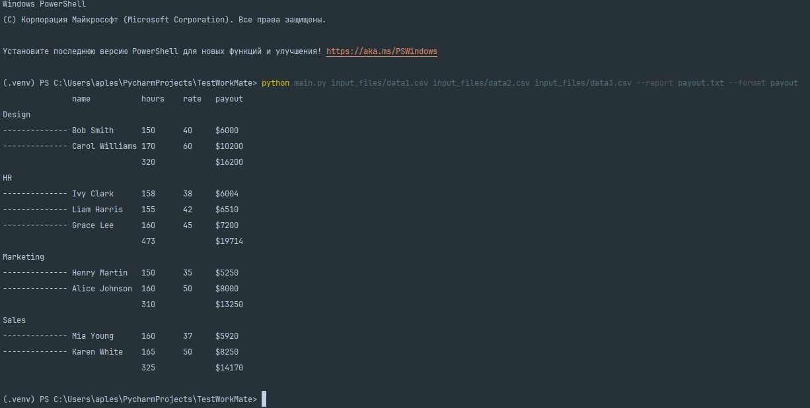

# Генератор Отчетов

Проект на Python для чтения данных сотрудников из CSV-файлов и генерации различных отчетов (например, по выплатам). Код легко расширяется: добавление новых форматов отчётов сводится к написанию отдельного модуля-форматтера и регистрации в системе.

---

## 📁 Структура проекта

```
└───TestWorkMate               
    │   casting.py                     # replace_values, cast_names                     
    │   cli.py                         # парсинг аргументов
    │   constant.py                    # константы (REPLACEMENT_VALUES)            
    │   csv_reader.py                  # чтение CSV и преобразование в Employee      
    │   employee.py                    # объen Employee      
    │   main.py                        # точка входа   
    │   pytest.ini                     # Инструкия для поиска модулей проекта для тестов.             
    │   Readme.md             
    │   register.py                    # реестр и декоратор форматтеров      
    │
    ├───formatters
    │       payout.py                  # функция для формирования отчета
    │
    └───tests                          # pytest - для основных модулей
            test_casting.py
            test_csv_reader.py
            test_employee.py
            test_register.py
```

---

## 🚀 Установка

1. Клонируйте репозиторий:

   ```bash
   git clone https://github.com/IvanOplesnin/TestWorkMate.git
   cd TestWorkMate
   ```

2. Создайте и активируйте виртуальное окружение (рекомендуется):

   ```bash
   python3 -m venv .venv
   source .venv/bin/activate    # Linux/macOS
   .\.venv\Scripts\activate   # Windows
   ```

3. Установите зависимости для разработки и тестирования:

   ```bash
   pip install -U pytest pytest-cov
   ```

> Все остальные зависимости входят в стандартную библиотеку Python.

---

## 🎯 Использование

1. Подготовьте CSV-файлы с любыми именами колонок из набора `{id, email, name, department, hours_worked, rate}` (альясами будут `hourly_rate`, `salary` для ставки).
2. Запустите генерацию отчёта:

   ```bash
   python main.py data1.csv data2.csv --report payout.txt 
   ```
3. Готовый отчёт появится в `payout.txt`, а также будет выведен в консоль.

### Параметры CLI

* `files` (обязательный): пути к CSV-файлам.
* `-f, --format` (по умолчанию `payout`): формат отчёта.
* `--report` (по умолчанию `output.txt`): имя выходного файла.

---
## 🏷️ Добавление алиасов колонок.

Ввиду непостоянства наших менеджеров, изменение файла constant.py предоставляет возможность быстро добавить новые алиасы для колонок.
Если вы хотите расширить список распознаваемых названий колонок для CSV, откройте файл `constant.py` и найдите словарь `REPLACEMENT_VALUES`. Добавьте или отредактируйте пары ключ: список\_алиасов, например:

```python
REPLACEMENT_VALUES = {
    # ...
    'rate': ['hourly_rate', 'salary', 'tariff'],
    'department': ['dept', 'division'],
}
```

Где ключ — каноническое имя поля, а список — альтернативные названия, которые будут автоматически распознаваться при чтении CSV.

---

## ✨ Расширяемость: добавление нового формата отчёта

1. Создайте новый файл `/formatters/<your_report>.py`.
2. Импортируйте `register_formatter` и `Employee`:

   ```python
   from registry import register_formatter
   from employee import Employee
   ```
3. Определите функцию-форматтер и зарегистрируйте её:

   ```python
   @register_formatter.add_func("your_report")
   def format_report_your(employees: list[Employee]) -> str:
       """Описание вашего отчёта для `--help`."""
       # ваша логика...
       return output_str
   ```
   Функция должна соответствовать написанной сигнатуре.
4. Запустите скрипт с `--format your_report`.

> Благодаря реестру вам не нужно изменять код CLI или registry: новый формат автоматически появится в списке доступных.

---

## 🔍 Тестирование

В проекте используются `pytest` и `pytest-cov`.

```bash
pytest --cov=.
```

Цель покрытия — ≥ 80% по важным модулям. Папка `tests/` содержит тесты для:

* `employee.py`
* `casting.py`
* `csv_reader.py`
* `registry.py`
---
## Примеры работы скрипта.
### В консоли.

### Созданный текстовыый файл.
